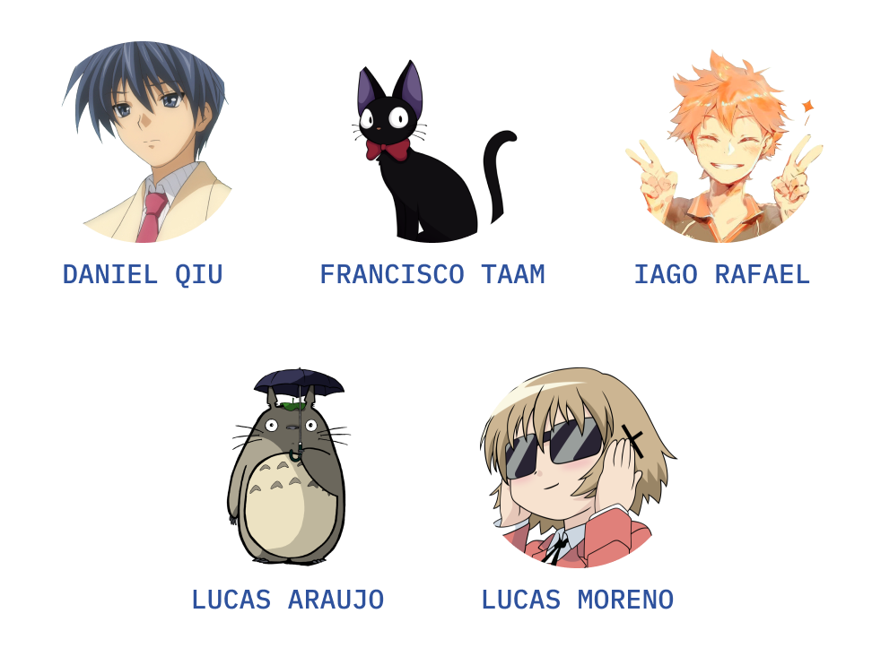

# Database_2021.2
MyAnimeList Database Work of 2021.2 (February/2022) from UFRJ.


## Pré-requisito

Antes de começar, verifique se você atendeu aos seguintes requisitos:
* Você instalou a versão mais recente de `mysql`
* Você fez o download dos arquivos .csv pelo site https://www.kaggle.com/marlesson/myanimelist-dataset-animes-profiles-reviews e os adicionou à pasta [csv_files](csv_files/) (os arquivos [animes.csv](csv_files/animes.csv) e [profiles.csv](csv_files/profiles.csv) já estão baixados, já o arquivo [reviews.csv](csv_files/reviews.csv) não foi baixado para o repositório por questões de limite de upload do GitHub)


## Como criar e popular o Banco de Dados?

1. Criar o Banco de Dados manualmente no `mysql`
```
CREATE DATABASE <databasename>;
```
Em `<databasename>`, escreva um nome de sua preferência.

2. Substitua `username`, `password` e `databasename` nos 3 arquivos em [data](data/) e nos 2 em [database](database/) pelas suas informações
```
engine = create_engine("mysql+pymysql://" + 'username' + ":" + 'password' + "@" + 'localhost' + "/" + 'databasename')
```

3. Execute os 3 arquivos `.py` em [data](data/)
```
Aqui vamos ler e limpar os .csv e criar os DataFrames pelo pandas
```

4. Execute o arquivo [creating_database.py](database/creating_database.py)
```
Aqui vamos criar nosso Banco de Dados
```

5. Execute o arquivo [adding_to_database.py](database/adding_to_database.py)
```
Aqui vamos adicionar as informações do DataFrame no nosso Banco de Dados
```

6. Substitua `username`, `password` e `databasename` no arquivo [connection.js](/web_app/connection.js) pelas suas informações
```
var mysqlConnection = mysql.createConnection({
    host: "localhost",
    user: "username",
    password: "password",
    database: "databasename",
    multipleStatements: true
});
```


## Como servir a nossa Aplicação Web?

1. Abra o terminal na pasta [web_app](/web_app)


2. Instale as dependências
```
  npm install
```

3. Sirva o WebApp
```
  npm start
```


## Autoria
* [Daniel Qiu](https://github.com/DANIELLWQIU)
* [Francisco Taam](https://github.com/Chicolego)
* [Iago Rafael Lucas Martins](https://github.com/iagorafaellm)
* [Lucas Araujo Carvalho](https://github.com/Chicolego)
* [Lucas Moreno Silva](https://github.com/Lucas-LMS)


